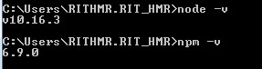
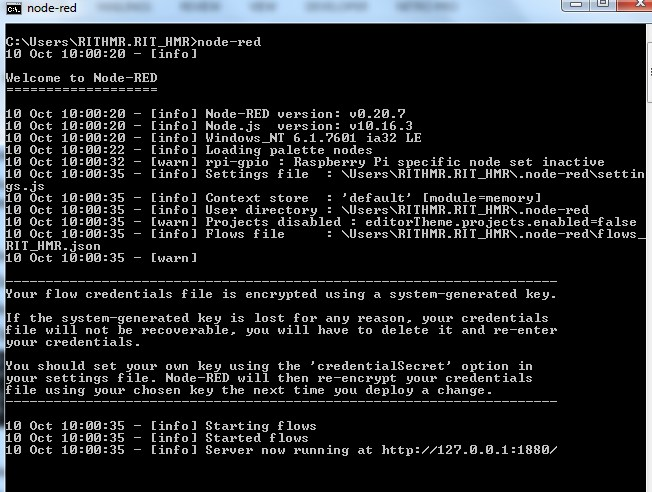

# Exercise 01: Understand Node-RED platform
Node-RED is a programming tool for wiring together hardware devices, APIs and online services in new and interesting ways. It provides a browser-based editor that makes it easy to wire together flows using the wide range of nodes in the palette that can be deployed to its runtime in a single- click.
    • Browser-based flow editing- 
    • Built on Node.js
    • Social Development 

# Installing node.js
    • Download Node.js from the link https://nodejs.org for windows x86 i.e 10.16.3 LTS version
    • Install it locally in your system.
    • Open the command prompt and display the versions of nodejs and npm as shown below.

# Installig Node-red
    • Run the below command in the command console.
        npm install –g –unsafe-perm node-red
    • After complete installation run the below command and note down the address given as shown below.
        node-red

# Open the browser
To access node-red from browser, give the link as: http://localhost:1880

