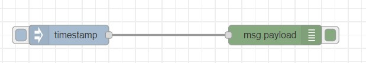
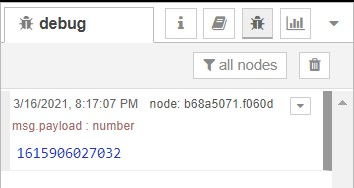

# Exercise 02: Your First Flow
The best way to explain “a flow” is by creating one. In this mini flow, we are going to inject a value into our debug window
    1. Open the browser
    2. In the address line enter http://localhost:1880
    3. Drag and drop “Inject node” from the nodes library into the flow editor (Once you have chosen the inject node, you should set some general explanation about its functionality in the info pane-no need to read that now).
    4. Drag and drop a “Debug node” from the nodes library into the flow editor.
    5. Crate a pipe between the inject and debug nodes by drawing a connection between their small grey rounded rectangles.
    6. Change from the info pane to the debug pane (Upper right).
    7. Deploy (=start) your flow.
    8. Once deployed, press the left blue rectangle that’s attached to the inject node. Check what’s happening in the debug pane. You should see numbers appear in the sidebar. By default, the Inject node uses the number of milliseconds since January 1st, 1970 as its payload.

# Flow Diagram

# Output

