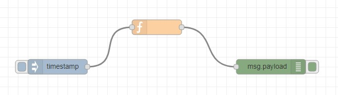
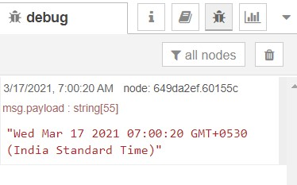

# Exercise 3: Printing date
1. Use the flow from Exercise 2
2. Add a Function node: The Function node allows you to pass each message though a JavaScript function.
3. Delete the existing wire (select it and press delete on the keyboard).
4. Wire a Function node in between the Inject and Debug nodes.Double-click on the Function node to bring up the edit dialog.Copy the following code into the function field:

##### //Create a Date object from the payload
var date = new Date(msg.payload);
##### //Change the payload to be a formatted Date string 
msg.payload = date.toString();
##### //Return the message so it can be sent on 
return msg;

5. Click done to close the edit dialog and then click the deploy button.
6. Now when you click the Inject button, the messages in the sidebar will now be formatted is readable timestamps.

# Flow Diagram:

# Output:

