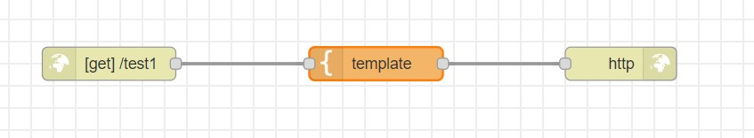
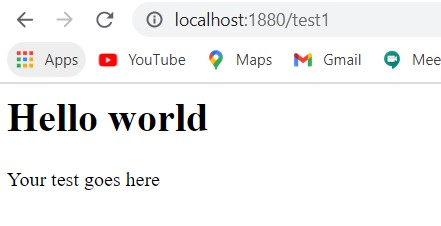

# Exercise 5: Printing custom messages on web server
1. From the input panel, choose http node
2. Change the properties of your http node so that it will respond to GET requests to /test1 from a web browser.
3. Add a template node (from functional panel), and add html code
4. Add a http response node from the output panel.
5. Write your flow together as shown below:

# Flow Diagram:

# Output:

