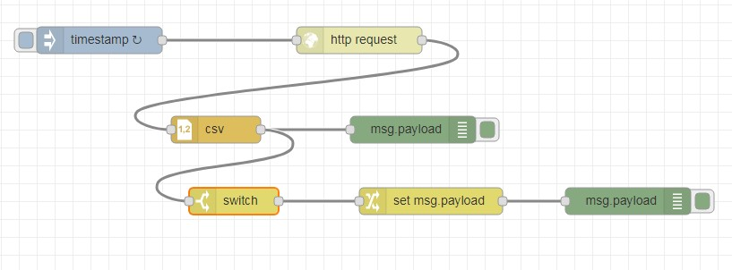

# Experiment-06: Retrieve information from a website at a regular interval, Convert that information into a useful form and Display the result in the Debug sidebar
1. Add an Inject node, set the repeat interval to every 5 minutes.
2. Add an HTTP Request node
The HTTP Request node can be used to retrieve a web-page when triggered.
After adding one to the workspace, edit it to set the URL property to: https://earthquake.usgs.gov/earthquakes/feed/v1.0/summary/significant_week.csv
This URL is a feed of significant earthquakes in the last 7 days from the US Geological Survey web site.
The site offers a number of other options that you may want to play around with after completing this tutorial.

3. Add a CSV node, Enable option for ‘First row contains column names’.
4. Add a Debug node
5. Wire them all together, Add wires connecting:
•	The Inject node output to the HTTP Request node input.
•	The HTTP Request node output to the CSV node input.
•	The CSV node output to the Debug node input.
6. Add a Switch node
•	Edit its properties and configure it to check the property msg.payload.mag with a test of
•	>= and the value 7.
•	Add a second wire from the CSV node to this Switch node.
7. Add a Change node
•	Add a Change node, wired to the output of the Switch node.
•	Configure it to set msg.payload to the string PANIC!.
8. Add a Debug node
•	Wire a new Debug node to the output of the Change node
9. Deploy
•	Deploy the flow to the runtime by clicking the Deploy button.
•	With the Debug sidebar tab open click the Inject button.

# Flow Diagram:

# Output:

## Conclusion:
This flow is automatically triggered every 1 minutes and retrieves data from a url. It parses the data and displays in the Debug sidebar. It also checks the magnitude value in the data and branches the flow for any messages with a magnitude greater than, or equal to, 7. The payloads of such messages are modified and displayed in the Debug sidebar.

