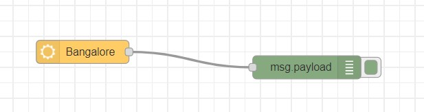
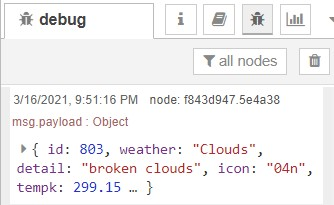

# Exercise 07: Using openweathermap API to get details of a particular location

1.	use openweathermap node
2.	goto manage palette and install openweathermap
3.	goto openweathermap.org and sign up and generate API key
4.	provide API key in the openweathermap pallete

# Flow Diagram:

# Output:

