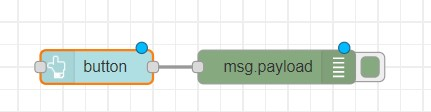
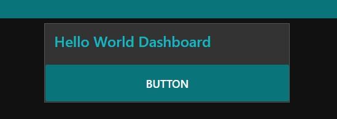

# Exercise 08: Creating dashboard
1.	Install node red dashboard from manage palette
2.	Add button and debug node
3.	Double click on button, Add to a group, we dont have a tab, create it and call it as Hello world and group as Hello World dash board.
4.	Deploy it.
5.	Access the dashboard in the URL: http://localhost:1880/ui

# Flow Diagram:

# Output:

