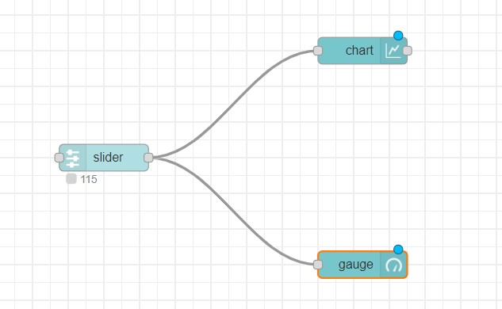
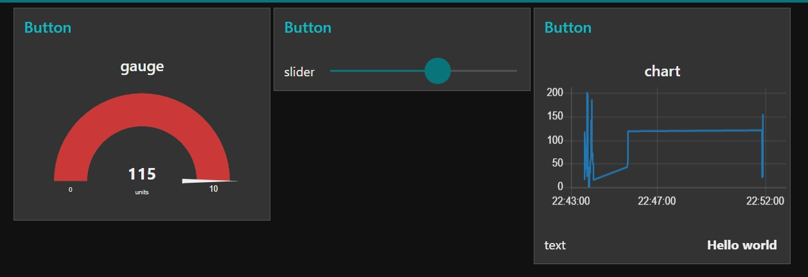

# Exercise 09: Creating dashboard-charts
1.	Add slider, gauge and chart nodes
2.	Double click on all the three nodes and to the same group, Add to a group, we dont have a tab, create it and call it as Button and group as Button.
3.	Deploy it.
4.	Access the dashboard in the URL: http://localhost:1880/ui
5.	Play around the properties of gauge, chart and slider

# Flow Diagram:

# Output:

