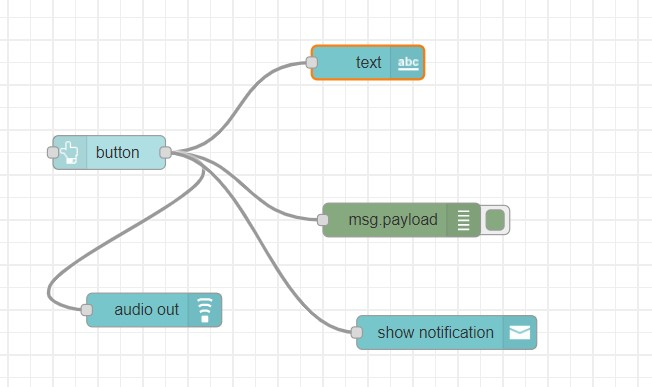
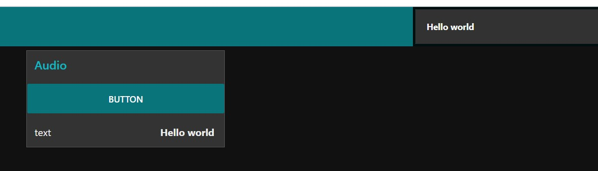

# Exercise 10: Creating dashboard-audio out
1.	Add button, text, audio out, notification and debug nodes
2.	Double click on all the nodes and to the same group, Add to a group, we dont have a tab, create it and call it as Audio and group as Audio.
3.	For notification node, choose top right option
4.	Deploy it.
5.	Access the dashboard in the URL: http://localhost:1880/ui

# Flow Diagram:

# Output:

