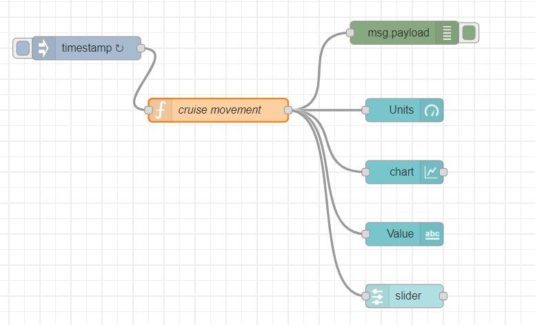
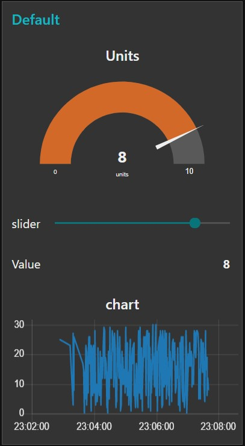

# Exercise 11: Creating dashboard-Generating random number and display on widgets
1.	Add inject, function, debug, gauge, chart, text and slider nodes.
2.	Double click on all the nodes and to the same group, Add to a group, we dont have a tab, create it and call it as Movement and group as Movement.
3.	For the function node, add this code to generate random numbers
msg.payload = Math.round(Math.random(50)*30);
return msg;
4.	Deploy it.
5.	Access the dashboard in the URL: http://localhost:1880/ui

# Flow Diagram:

# Output:

