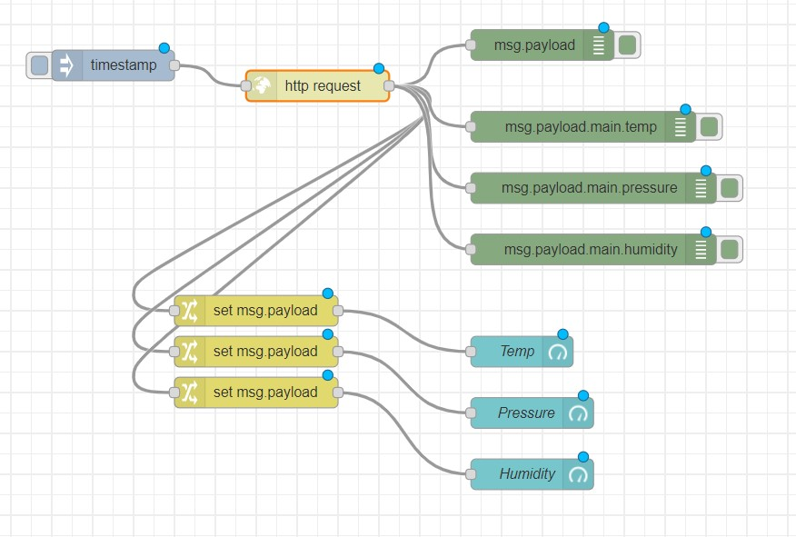
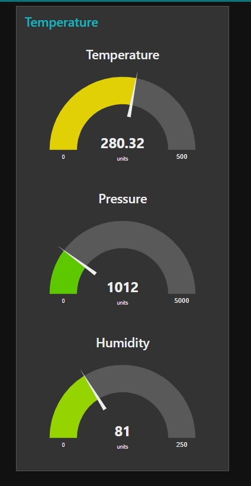

# Exercise 4: To Setup a basic web server in Node-Red

1.	From the input panel, choose http node
2.	Change the properties of your http node so that it will respond to GET requests to /mypage from a web browser.
3.	Add a template node (from functional panel), and add a http response node from the output panel.
4.	Write your flow together as shown below:
5.	Deploy your flow
6.	Once deployed, open a separate browser window enter localhost:1880/mypage

# Flow Diagram:

# Output:

