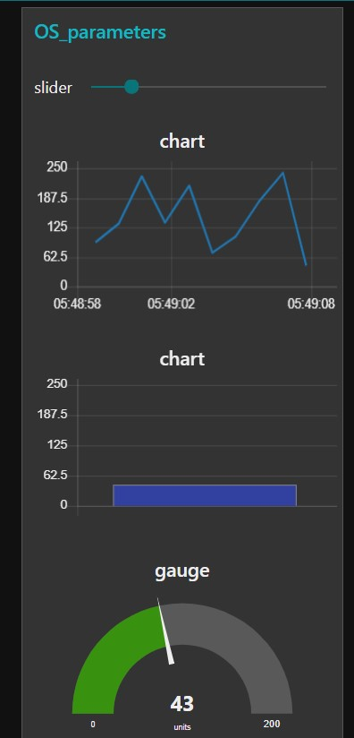

# Exercise 13: Creating dashboard-Error checking criterion
1.	Add inject, function, debug, gauge, chart, slider nodes an audio out nodes.
2.	Double click on all the nodes and to the same group, Add to a group, we dont have a tab, create it and call it as OSParameters and group as OSParameters.
3.	For the function node, add this code to generate random numbers
msg.payload = Math.round(Math.random(50)*30);
return msg;
4.	For the Second function node, add this code

if(msg.payload >= "150")
{
    msg.payload = "Too High!";
}
return msg;

5.	If random number is greater than 150, TOO high message is popped out from an audio node.
6.	Deploy it.
7.	Access the dashboard in the URL: http://localhost:1880/ui

# Flow Diagram:

# Output:

