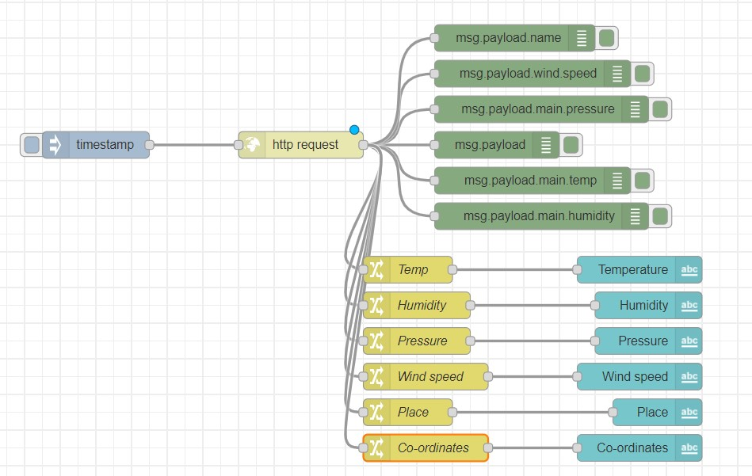
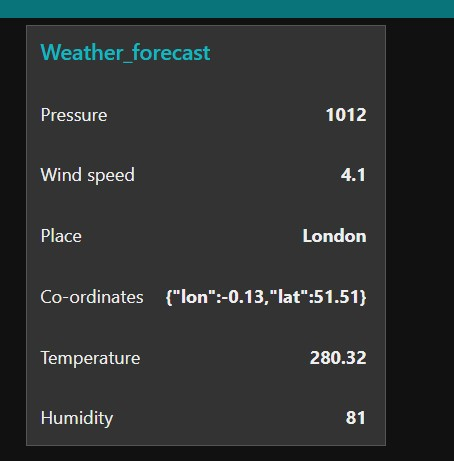

# Exercise 15: Creating dashboard-displaying temperature, humidity, pressure of a location
1.	Add inject, change, debug, and text nodes.
2.	Double click on all the nodes and to the same group, Add to a group, we dont have a tab, create it and call it as Weather_forecast and group as Weather_forecast.
3.	For the http request node, make a GET request to the URL: https://samples.openweathermap.org/data/2.5/weather?q=London,uk&appid=b6907d289e10d714a6e88b30761fae22 
4.	For the change nodes, set the property to payload.main.temp, payload.main.pressure, payload.main.humidity,payload.main.wind.speed,paload.mai.cord and payload.main.name respectively.
5.	Deploy it.
6.	Access the dashboard in the URL: http://localhost:1880/ui
7.	Play around the properties of gauge, chart and slider

# Flow Diagram:

# Output:

