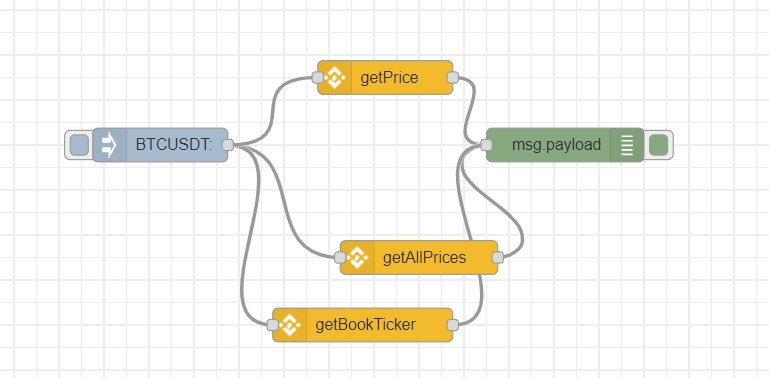
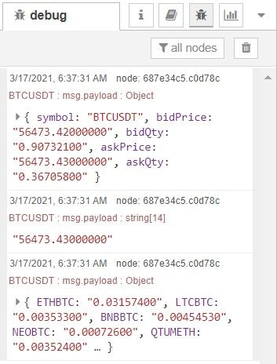

# Exercise 16: Crypto currencies and Node-Red

Node-RED is a perfect tool for rapid development of crypto currency applications. There are a wide range of uses, starting with simple access to exchange data (e.g. prices, trends) right up to developing your own block chain!

Getting and displaying basic cryptocurrency data using Node-RED
The Binance node
Binance is one of the largest crypto trading platform (perhaps largest by volume), and importantly has a comprehensive and sophisticated API. The resident cryptocurrency expert, Ted, over at Sense Tecnic Systems (STS) recently decided to jump in and develop a new Node for accessing and using the Binance cryptocurrency platform.

Simple flow to get all market data
•	For this demo we’ll use the Binance getPrice node. The Binance getPrice node takes a simple ticker pair as input and returns the current price for that ticker. For this example, we’ll use the Bitcoin to Tether USD ticker pair, which is BTCUSDT. We’ll use the inject node to send that to the getPrice node, so double click on the inject node, set the payload to an empty string, and set it’s topic  to BTCUSDT 
•	The getPrice node looks for a ticker pair on the incoming message topic and uses that to make an API call to the Binance platform, which returns the current price. Our simple flow then passes that to a debug node, which will show the results in the debug pane on the right side of Node-RED window.
Binance node main features
The Binance node set covers two main areas of functionality – accessing market data and account related functionality
•	getPrice: Gets the latest price of a symbol. Takes a ticker pair as input and returns the current price
•	getAllPrices: Gets the latest price of all symbols. No input and returns an {object} map of all available ticker pairs and their current prices
•	getBookTicker: Gets the bid/ask prices for a symbol. Takes a ticker pair as input and returns an {object} info on latest book price
•	getDayStats: Get the 24hr ticker price change statistics for a symbol. Takes a tickerPair as input and returns the latest 24h stats
•	getCandlesticks: Get Kline/candlestick data for a symbol. Takes a tickerPair, time interval and start/ed times and returns an {array} of candlesticks/kline data specified by parameters
Go ahead and wire up your flow as described, deploy it and then click on the inject node and you’ll see the current price in the debug pane as shown below.

Let’s continue our simple example shown above but extend it to get all market info. For that we’ll need the getAllPrices node which, as you’d expect, returns all the prices that Binance handles. It’s a long list and is returned as an object. However, we can display it in the debug pane, so let’s modify our original flow and replace the getPrice node with a getAllPrices node as shown below. Note that the inject node doesn’t need to set the topic – although its ignored if you do.
Getting bid/ask prices
As a final example, let’s return to the BTCUSDT ticker pair and get the full book info for it using the getBookTicker node. Using the first flow that injects BTCUSDT as a message topic, replace the getPrices node with a getBookTicker

# Flow Diagram:

# Output:

